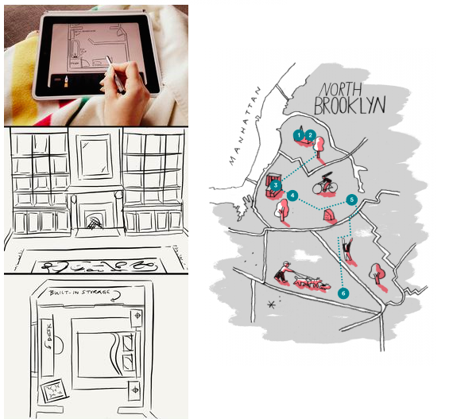

Consider the [megatrends](http://skift.com/2015/01/13/new-skift-magazine-megatrends-defining-travel-in-2015/) shaping the future of travel:

* mobile
* seamless
* experiential

[A new mode of travel](https://github.com/wx-labs/concept/blob/master/resources.md#the-future-of-travel) is emerging, with different objectives and expectations.  This presents new design opportunities.

Wx is focused on [psychogeographic engineering](https://en.wikipedia.org/wiki/Psychogeography).  We're all about the [pragmatics](https://en.wikipedia.org/wiki/Pragmatics) of place.  

We aim to develop a toolkit to help guide travelers through unfamiliar territory.  More ambitiously, we'd like to facilitate the construction of a network of micro-expeditions curated by local insiders.

Our initial toolset is targeted at Airbnb [superhosts](https://www.airbnb.com/superhost) and their guests, viz ...

**Trax** is a tool for encoding a host's personal psychogeography: their own
idiosyncratic view of home and neighborhood.  It's the napkin on which a host
can sketch out a personalized map of their domain for guests.

**Trex** is a companion tool for guests.  It provides access to a host's
**trax**, the curated micro-expeditions originating from their accomodations.

So, we say that a host *lays* **trax** and a guest *makes* **trex** along
these trax.  A host can lay a single **trak** for a guest to **trek**.
**Trakking** is the laying of trax and **trekking** is the undertaking of trex.

What's novel about trax is that they form a network of possible trex. A guest making a trek along their host's trax can access the trax of other hosts whenever accessible (i.e., when they intersect at some node point).

Thus, guests have access to a network of local micro-expeditions from those who know that locality best.
