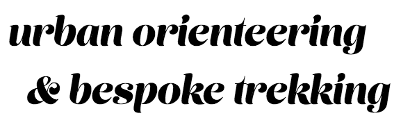

First, consider the [megatrends](http://skift.com/2015/01/13/new-skift-magazine-megatrends-defining-travel-in-2015/) shaping the future of travel:

* mobile
* seamless
* experiential

Now ...

Think **experiential travel**.

Think **expedition**.

Think **elite mountaineering guide**.

Think **sherpa**.

Think **siri**.

So ... **xrpi** (pronounced *sherp-ee*): a project that aims to enable a new form of peer-to-peer urban orienteering and bespoke trekking.

New endeavors require new terms, but naming is a tricky.

Instead of naming things once and for all, I think it's useful to first coin a few provisional terms.  These can serve as placeholders, allowing us to differentiate pieces of the larger project without prematuraly committing us to 
a set of terms that ultimately don't cohere.

The terms that follow should be understood as such: ad hoc coinages, functioning as provisional standins for more suitable, reflectively derived names.

---

**TREX** is ...

---

The **Xrpi Collective** is ...
